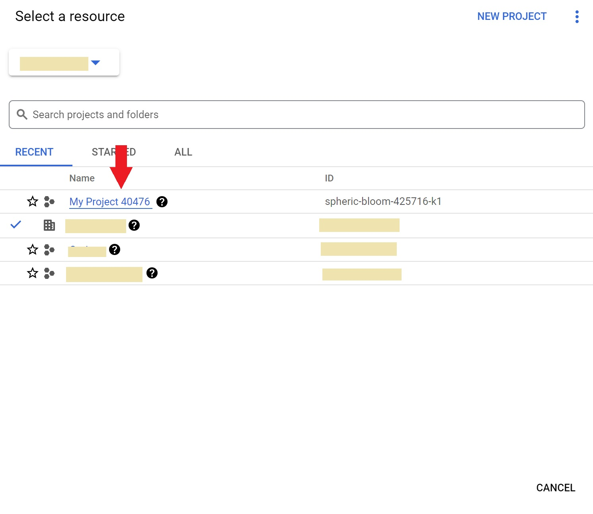
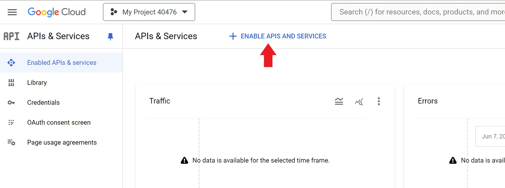
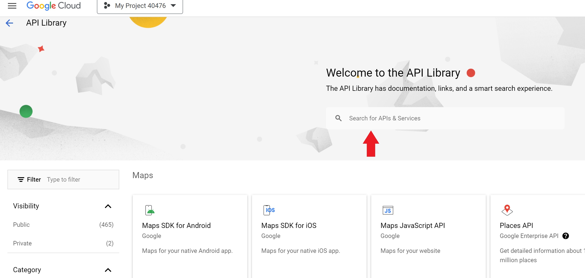
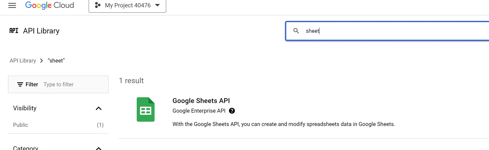
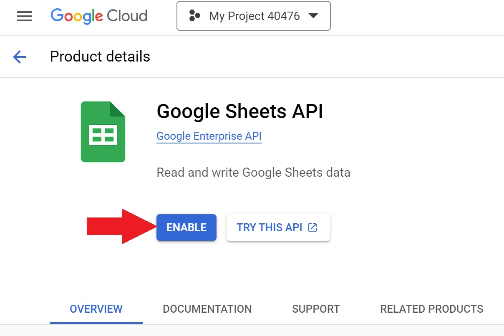
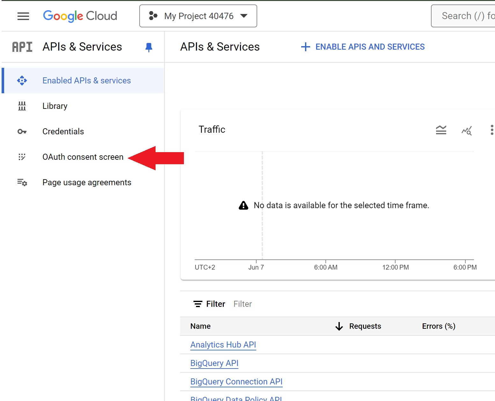

:::note
Prerequsits

- Google conslole access
  :::

### Step 1 - Create Project

Go to https://console.cloud.google.com/ and create a new project

Back on the front page now select the newly created project

### Step 2 - Enable the Sheet API

Click enable apis and services

and search for sheets

### Step 3 - Setup Consent screen

Back on the APIs and Services to set up a OAuth consent screen

The first step depends very much on how your organization is set up but it should make sense by reading through the options
If you are unshure select external and only fill out the required fields

