:::note
Prerequsits

- Google conslole access
  :::

### Step 1 - Create Project

Go to https://console.cloud.google.com/ and create a new project

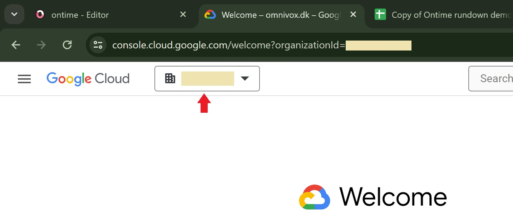

Back on the front page now select the newly created project

### Step 2 - Enable the Sheet API

Click enable apis and services

and search for sheets

### Step 3 - Setup Consent screen

Back on the APIs and Services to set up a OAuth consent screen

The first step depends very much on how your organization is set up but it should make sense by reading through the options
If you are unshure select external and only fill out the required fields

When thats done click "ADD OR REMOVE SCOPES"

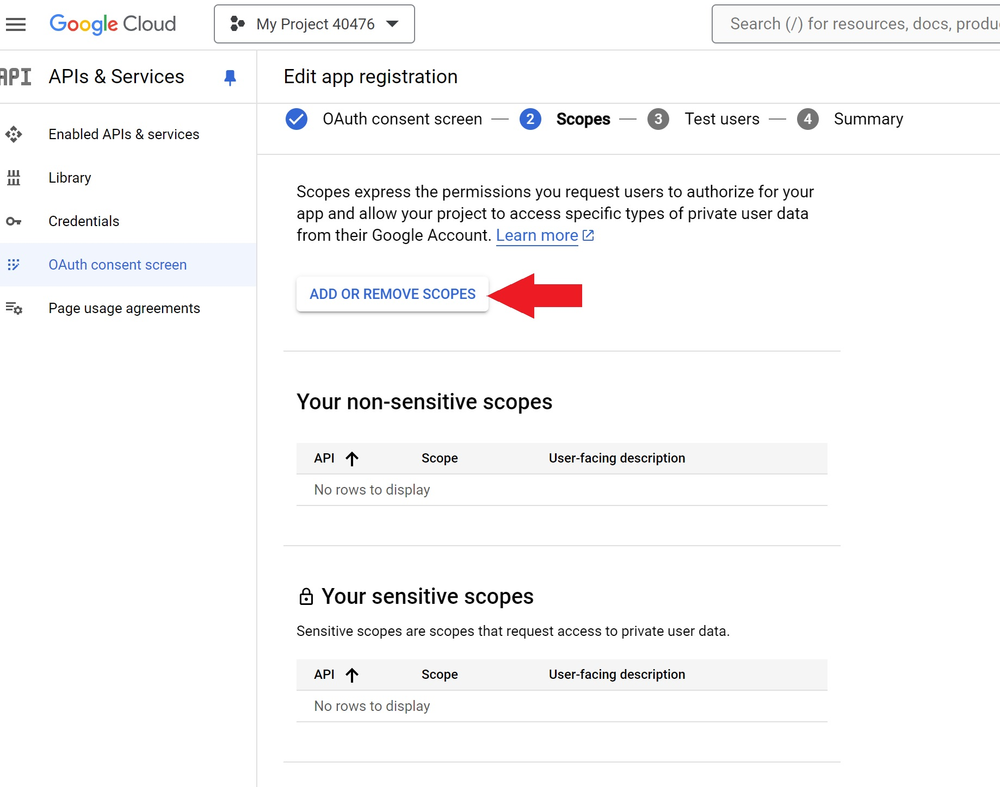

And filter for sheets, add "/auth/spredsheets" and click update

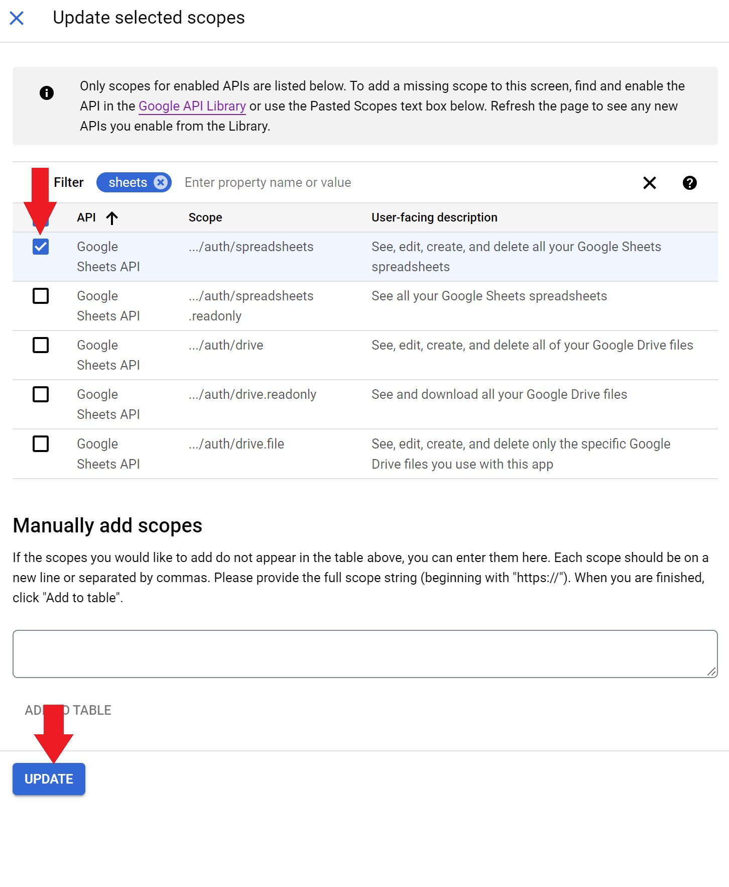

Click save and continue

For "Test users" add the email(s) the will be using this

Then Save and go back to the dashboard

### Setp 4 - Create Credentials

Go to Credentials

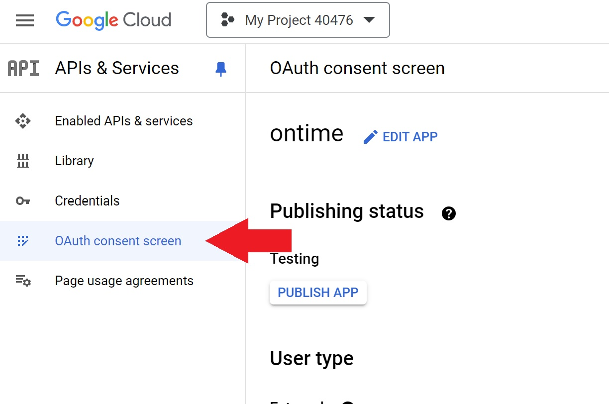

Click Create Credentials and select OAuth client ID

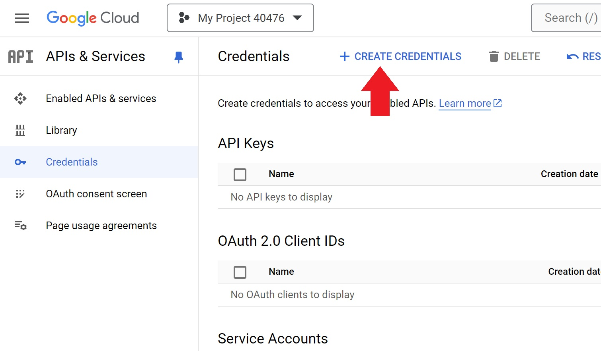
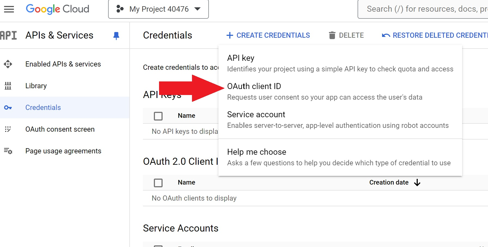

For Application type select TVs and Limited input device, give it a name and click create

Download the result, we are now done with the Google console

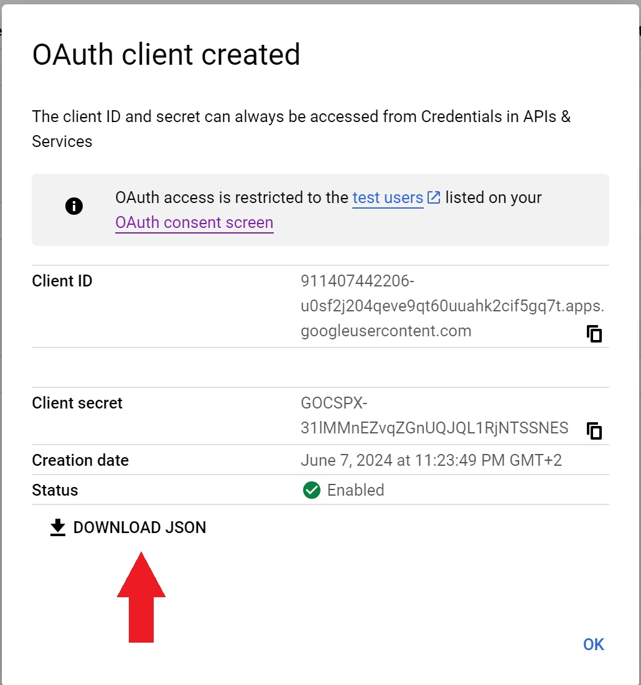

### Setp 5 - Connect Ontime

Go to the sheet sync settings

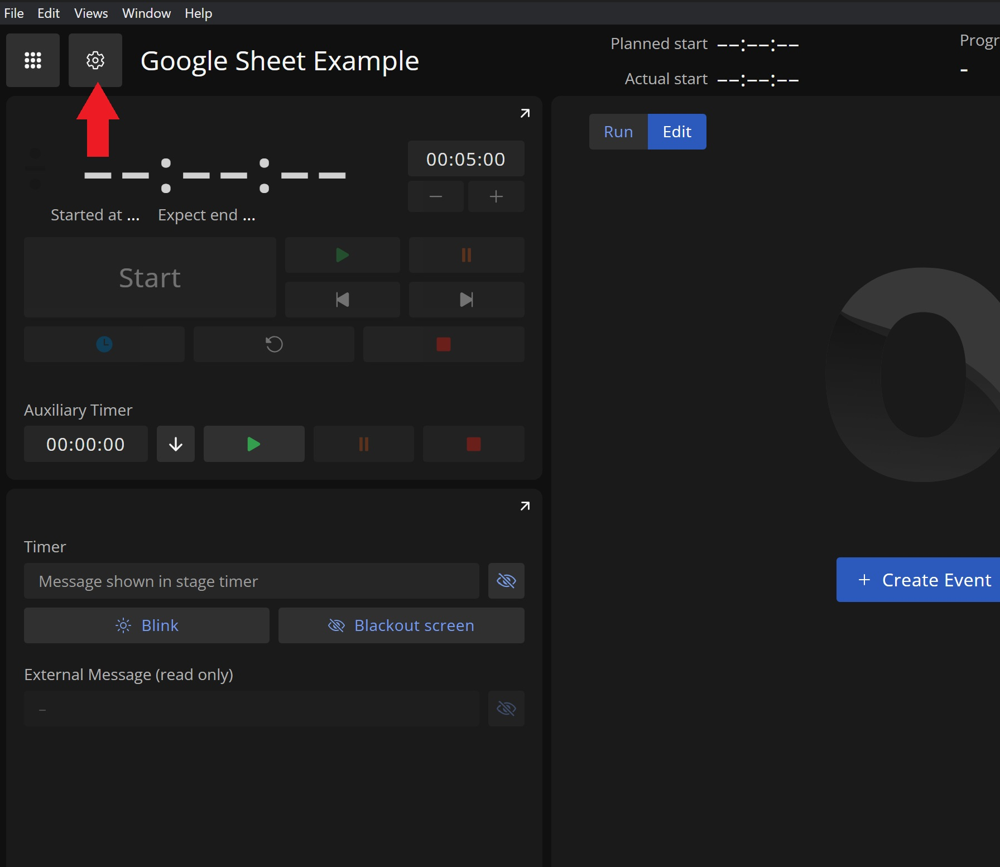

Here upload the file just download from the Go console

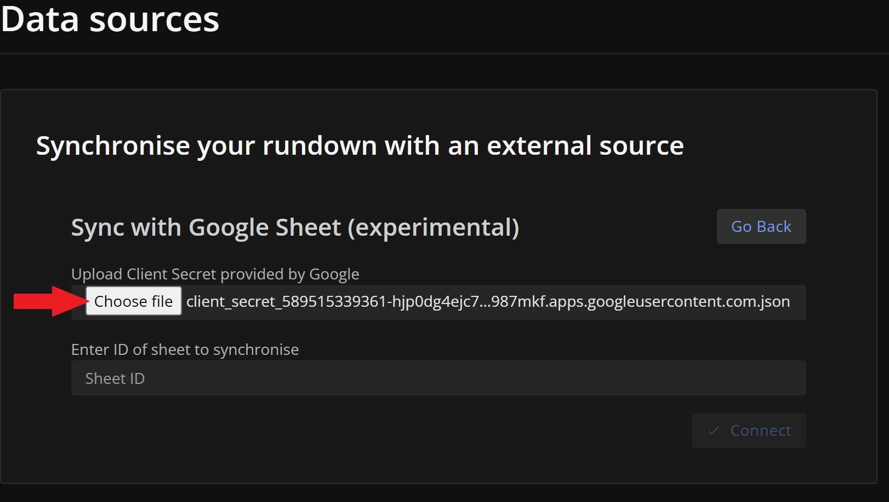

Get the sheet ID and past it in Ontime and click connect

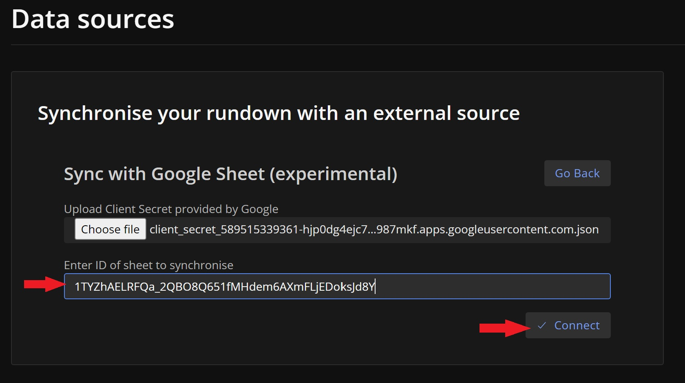

Copy the code and click authenticate and follow the instructions from google

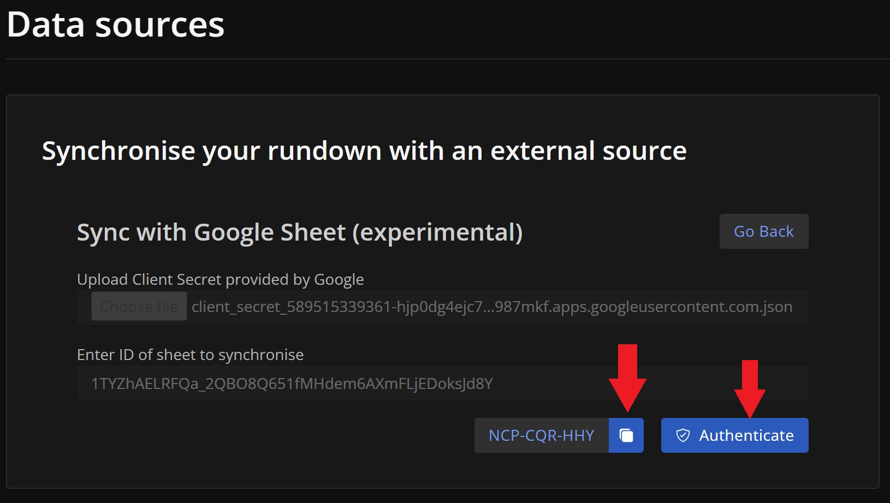
